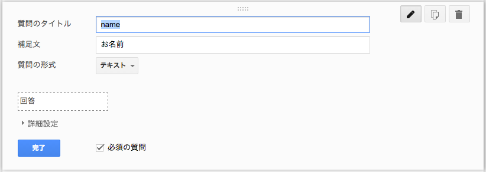

# Google\_Form\_Client (alpha)

## これはなに

Google Drive のGoogleフォームにポストする為のクライアントライブラリです。

フォームのHTMLをスクレイピングして処理する為、Googleフォームが出力するHTMLに完全に依存します。
したがって、Googleフォーム公式の仕様変更の度合いによっては動かなくなる可能性があります。


## 使い方

```php
require "Google_Form_Client.php";

$gf = new Google_Form_Client(
	"https://docs.google.com/forms/d/XxxXXXxxxxXXXXX/viewform"
);

$result = $gf->post(array(
	"name" => "山田 太郎",
	"gender" => "男性",
	"browser" => array(
		"Internet Explorer",
		"Google Chrome"
	)
));

if(! $result){
	die("ポストに失敗しました");
}
```

### フィールドのキー



`post()` に渡す連想配列のキーには、「質問のタイトル」に設定したテキストを入れます。

### フィールドの値

フィールドの値は「チェックボックス」タイプを除いて、全てテキストでポストします。
「チェックボックス」は複数選択が可能な為、配列でポストします。
（選択がひとつのみの場合も配列にします）

```php
// 選択したい値がひとつの場合も配列に
$gf->post(array(
	"browser" => array("Internet Explorer")
));
```

### 使用出来るフィールドタイプ（質問の形式）

基本的な形式は使用可能ですが、次の物については対応していません。

- スケール
- グリッド
- 日付
- 時間

### バリデーションとエラー

簡易的なバリデーションメソッドを実装しています。
`validate()` メソッドで値の確認を行い、発生したエラーは `getErrors()` で取得できます。
`validate()` メソッドは `post()` メソッドの内部でも実行されています。

```php
$valid = $gf->validate(array( ... ));

if(! $valid){
	var_dump($gf->getErrors());
}
```

`validate()` では下記の項目について検証しています。

- 必須項目に入力されているか
- 選択項目（ラジオボタン・チェックボックス・リスト）にある値が入力されているか
- Eメールアドレス・URLの検証


### 設定

コンストラクタの第二引数または `config()` メソッドで設定の変更を行います。

```php
// コンストラクタで設定をする
$gf = new Google_Form_Client(
	"https://docs.google.com/forms/d/XxxXXXxxxxXXXXX/viewform",
	array(
		"cache" => true,
		"cache_dir" => "cache",
		"cache_lifetime" => 3600,
		"cache_filemode" => 0660,
		"curl" => array(
			CURLOPT_TIMEOUT => 30
		)
	)
);
```

インスタンス生成後に設定を変更したい場合は、
`config()` の処理後に `load()` メソッドでGoogleフォームを読み込みます。

```php
// メソッドで設定する
$gf = new Google_Form_Client();
$gf->config(array( ... ));
$gf->load("https://docs.google.com/forms/d/XxxXXXxxxxXXXXX/viewform");
```

- **cache** :Boolean (false) ... キャッシュを使用する
- **cache_dir** :String ("cache") ... キャッシュ保存用のディレクトリパス
- **cache_lifetime** :Integer (3600) ... キャッシュの寿命（秒）
- **cache_filemode** :Integer (0660) ... キャッシュファイルのファイルモード（8進法）
- **curl** :Array ... cURLのパラメータ設定

